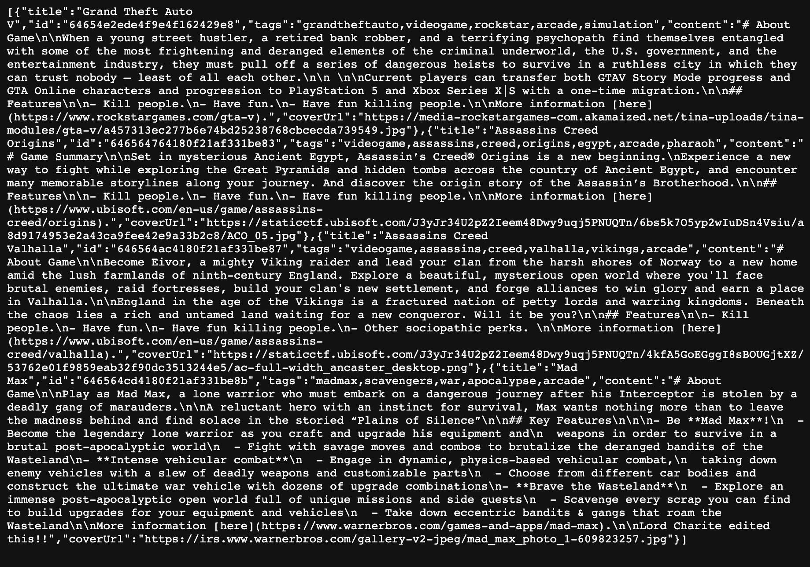
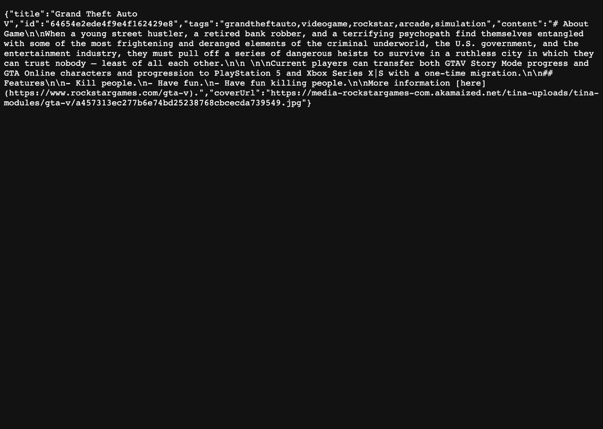

# Notes API

Express server with a MongoDB database for storing notes.

[deployed url](https://notes-api-siavava.onrender.com/api/posts)

[deployed frontend url](https://notes-frontend-siavava.onrender.com/)

## What Worked Well

Express and MongoDB are straightforward to use.

Another student had issues with their api starterpack but the same never occurred for me.

## What Didn't

Nothing.

## Extra Credit

> In progress

## Screenshots

### All posts

---

### Single post

